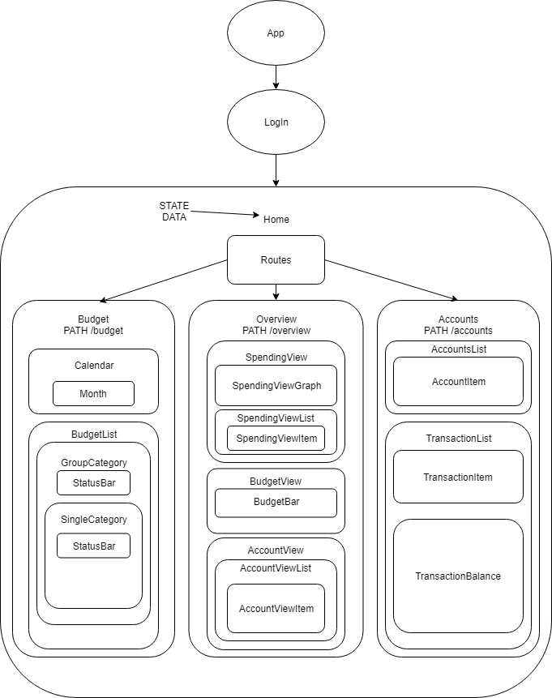
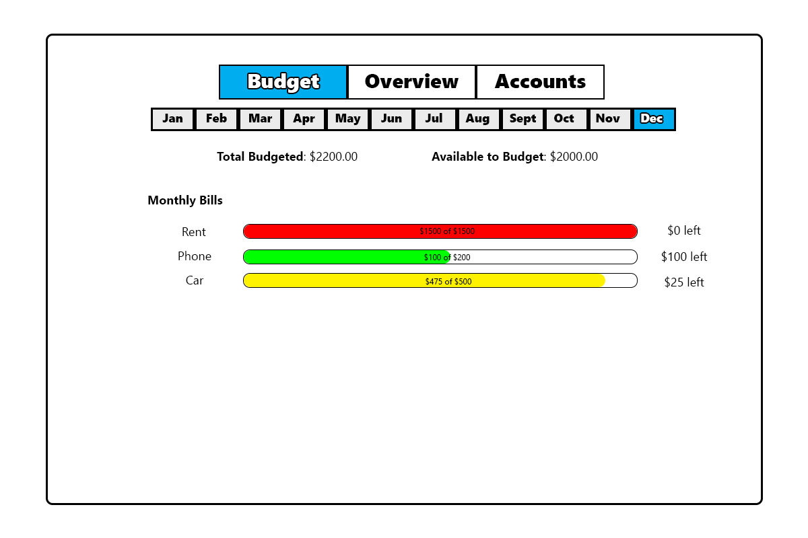

# Capstone-Planning
Initial plan for Epicodus Capstone Project 12/7/2018
Link to project -> https://github.com/HyungNLee/Budget_App
## Project Description
* Name of Student: Hyung Lee
* Name of Project: Budget Application
* Project's Purpose or Goal: Personal Budget/Finance Tracker
* List of absolute minimum features the project requires to meet this purpose or goal: 
  1. Ability to create a custom budget the user wants to follow.
  2. Ability to input incoming/outgoing cash flow with the name of the transaction.
  3. Add cloud storage for persistent budget.
* What tools, frameworks, libraries, APIs, modules and/or other resources will you use to create this MVP?
  - React
  - Redux
  - Fireball or MySQL
  - Bootstrap
  - JavaScript
* Features to include beyond the MVP:
  - Ability to create categories for the budget and allocate resources to these budgets from the total budget.
  - Ability to categorize outgoing/incoming cash flow.
* What additional tools, frameworks, libraries, APIs, or other resources will these additional features require?
  - Possibly would use another deployment site like Docker or Heroku.
## Component Diagram
* 
## Mock Budget UI
* 
## Example State
```
  State = {
    currentUserId: 1,
    budget: {
      groupCategories: {
        usxhs223: {
          name: 'Monthly Bills',
          budgeted: 500,
        },
      },
      subCategories: {
        7982uus: {
          name: 'Rent',
          budgeted: 450,
          masterListId: 'usxhs223'
        },
        8732616: {
          name: 'Phone Bills',
          budgeted: 50,
          masterListId: 'usxhs223'
        },
      }
    },
    transactionList: {
      jies866: {
        categoryId: '7982uus',
        description: 'Rent for apartment.',
        payee: 'Oak Hills Apartments',
        type: 'Expense',
        amount: 450,
        date: '11/12/2017'
      },
    },
  }
```
